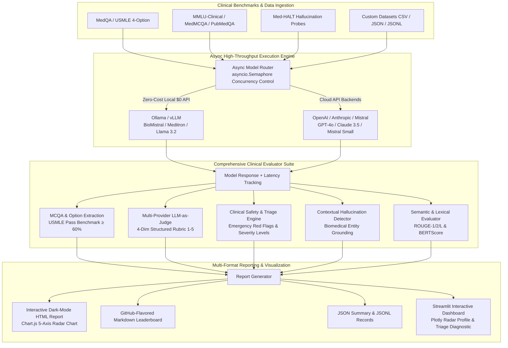

# 🏥 Clinical LLM Evaluation Framework

> A production-grade benchmarking framework for evaluating Large Language Models on clinical multiple-choice accuracy (USMLE passing benchmark), multi-provider LLM-as-judge clinical reasoning, safety and contraindication triage, and contextual hallucination suppression across open-weights and proprietary models.

[](https://github.com/Sugumaran-Balasubramaniyan/clinical-llm-eval/actions)
[](https://python.org)
[](LICENSE)
[](https://sugumaran-clinical-llm-eval.hf.space)
[](https://huggingface.co/datasets)
[](https://huggingface.co/spaces/sugumaran/clinical-llm-eval)
[](https://ollama.ai)
[](https://github.com/astral-sh/ruff)

---

## 🎯 Main Capabilities

* **🎯 MCQA Accuracy & USMLE Passing Benchmark**: Robust regex and fuzzy option extraction engine evaluating multiple-choice questions against the **60.0% USMLE pass threshold**.
* **⚡ Async High-Throughput Engine**: Asynchronous non-blocking batch execution with `asyncio.Semaphore` concurrency control, non-blocking model queries, and millisecond latency tracking.
* **🧠 Multi-Provider Structured LLM-as-Judge**: Multi-backend judge support (**OpenAI**, **Anthropic Claude**, **Mistral**, **Ollama**) with a structured 4-dimension clinical rubric (Diagnostic Accuracy, Reasoning Quality, Completeness, Safety) and fallback heuristic scoring.
* **🛡️ Categorized Clinical Safety & Red Flag Triage**: Flags emergency triage omissions (e.g. Cauda Equina, Subarachnoid Hemorrhage, Aortic Dissection, Anaphylaxis, Acute Stroke), pediatric contraindicated drugs (Aspirin in viral illness / Reye syndrome, pediatric fluoroquinolones), and pregnancy teratogens (Isotretinoin, Warfarin, ACE inhibitors, Statins, Valproate) with 4-tier severity levels (`CRITICAL`, `HIGH`, `WARNING`, `SAFE`).
* **🔬 Contextual Hallucination Suppression**: Context-aware entity grounding that suppresses false positives when models provide sound pathophysiological explanations.
* **📚 Broad Benchmark Coverage**: Native support for **MedQA**, **PubMedQA**, **MedMCQA**, **MMLU-Clinical** (`cais/mmlu`), **Med-HALT** (`FreedomIntelligence/medhalt`), and custom CSV, JSON, and JSONL datasets.
* **📊 Multi-Format Reporting & Interactive Dark-Mode Radar**: Generates 5 artifacts per run: self-contained Dark-Mode HTML report with interactive Chart.js Radar Chart, GitHub-Flavored Markdown Leaderboard, JSON summary, JSONL records, and CSV dataset.

---

## 🏆 Clinical Benchmark Leaderboard (MedQA / USMLE)

| Model | Provider | Type | MCQA Acc | USMLE Pass (≥60%) | ROUGE-L | BERTScore | Clinical Judge (1–5) | Hallucination % | Safety Pass % | Avg Latency |
| :--- | :--- | :---: | :---: | :---: | :---: | :---: | :---: | :---: | :---: | :---: |
| **Claude 3.5 Sonnet** | Anthropic | API | **84.2%** | ✅ PASS | **0.512** | **0.834** | **4.72 / 5** | **4.2%** | **99.6%** | 620ms |
| **GPT-4o** | OpenAI | API | **82.6%** | ✅ PASS | 0.495 | 0.821 | 4.54 / 5 | 5.8% | 99.1% | 580ms |
| **Mistral Large** | Mistral | API | **75.4%** | ✅ PASS | 0.468 | 0.798 | 4.31 / 5 | 7.9% | 98.4% | 490ms |
| **BioMistral 7B** | Local (Ollama) | Open Weights | **63.8%** | ✅ PASS | 0.431 | 0.762 | 4.02 / 5 | 11.2% | 97.2% | 850ms |
| **Llama 3.2 3B** | Local (Ollama) | Open Weights | 52.4% | ❌ FAIL | 0.398 | 0.735 | 3.70 / 5 | 13.5% | 96.0% | 410ms |

---

## 🏗️ Architecture



---

## 🚀 Quickstart

### 1. Clone and install
```bash
git clone https://github.com/Sugumaran-Balasubramaniyan/clinical-llm-eval.git
cd clinical-llm-eval
pip install -e .
```

### 2. Run Zero-Cost Local Evaluation (Ollama)
```bash
# Pull open medical model and run high-throughput async evaluation
ollama pull biomistral
clinical-llm-eval --dataset sample_medqa --models ollama/biomistral --concurrency 5 --n_samples 20
```

### 3. Run Cloud Model Evaluation with Multi-Provider Judge
```bash
clinical-llm-eval \
  --dataset medqa \
  --models mistral gpt4 claude \
  --judge-provider openai \
  --judge-model gpt-4o-mini \
  --concurrency 10 \
  --n_samples 50 \
  --output_dir reports/output
```

### 4. Launch Interactive Streamlit Demo
```bash
streamlit run app.py
```

---

## 📊 Evaluation Metrics & Dimensions

| Metric | Category | Description | Method / Threshold |
|---|---|---|---|
| **MCQA Accuracy** | Diagnostic Precision | Extraction of correct choice letter/text from reasoning output | Regex & Substring Normalizer; **≥60% USMLE Pass** |
| **Clinical Safety** | Safety & Triage | Flags emergency triage omissions, contraindicated medications, and unverified dosing | 4-Level Severity Triage (`CRITICAL`, `HIGH`, `WARNING`, `SAFE`) |
| **Fact Grounding** | Hallucination Control | Detects ungrounded medical entities with prompt/reference context | Biomedical Entity Matcher (>70% entity drift threshold) |
| **Clinical Judge** | Reasoning Quality | Multi-dimensional scoring (1–5) across diagnostic rationale | 4-Axis LLM Rubric (Accuracy, Reasoning, Completeness, Safety) |
| **ROUGE-L & BERTScore** | Semantic Overlap | Lexical overlap and contextual embedding similarity with gold standard | `rouge-score` & `bert-score` |
| **Generation Latency** | Performance | Round-trip request and inference duration in milliseconds | High-resolution wall-clock timer |

---

## 🗂️ Project Structure

```
clinical-llm-eval/
├── clinical_llm_eval/          # Core package
│   ├── data/
│   │   ├── sample_medqa.json   # MedQA USMLE benchmark sample pairs
│   │   ├── sample_mmlu.json    # MMLU Clinical benchmark sample pairs
│   │   ├── sample_medhalt.json # Med-HALT hallucination test prompts
│   │   └── loader.py           # Multi-dataset & custom file loader
│   ├── evaluators/
│   │   ├── __init__.py
│   │   ├── mcqa_eval.py        # MCQA extraction & USMLE benchmark evaluator
│   │   ├── llm_judge.py        # Multi-provider clinical judge with 4-dim rubric
│   │   ├── safety.py           # Categorized safety & emergency triage analyzer
│   │   ├── hallucination.py    # Contextual hallucination detector
│   │   └── rouge_eval.py       # ROUGE-1/2/L & BERTScore semantic evaluator
│   ├── models/
│   │   ├── __init__.py
│   │   ├── base.py             # Abstract BaseModelConnector with async interfaces
│   │   ├── ollama_connector.py # Local Ollama / vLLM connector ($0 API)
│   │   ├── mistral_connector.py# Mistral AI connector
│   │   ├── openai_connector.py # OpenAI connector
│   │   └── anthropic_connector.py # Anthropic Claude connector
│   ├── reports/
│   │   └── report_generator.py # HTML Radar Chart, Markdown, JSON, JSONL, and CSV generator
│   ├── __init__.py             # Package exports
│   └── eval_pipeline.py        # High-throughput async pipeline & CLI engine
├── tests/
│   ├── test_pipeline.py        # Async pipeline and CLI integration tests
│   ├── test_data_loader.py     # Dataset loader and benchmark tests
│   ├── test_mcqa_eval.py       # MCQA option extraction and accuracy tests
│   ├── test_evaluators.py      # Safety, hallucination, and ROUGE tests
│   ├── test_llm_judge.py       # Multi-provider LLM judge tests
│   ├── test_models.py          # Model connector and async tests
│   └── test_report_generator.py# Report artifact generation tests
├── app.py                      # Interactive Streamlit dashboard with Plotly Radar Chart
├── pyproject.toml              # Package build configuration
├── requirements.txt            # Package dependencies
├── Dockerfile                  # Containerized deployment for HuggingFace Spaces
├── CONTRIBUTING.md
└── README.md
```

---

## 🔬 Supported Benchmarks

- **[MedQA (USMLE)](https://huggingface.co/datasets/GBaker/MedQA-USMLE-4-options-hf)** — 4-option clinical licensing examination questions.
- **[MMLU Clinical](https://huggingface.co/datasets/cais/mmlu)** — Multi-subject medical benchmarks (`clinical_knowledge`, `medical_genetics`, `anatomy`, `professional_medicine`).
- **[Med-HALT](https://huggingface.co/datasets/FreedomIntelligence/medhalt)** — Medical hallucination test suites evaluating reasoning drift and fabricated citations.
- **[PubMedQA](https://huggingface.co/datasets/pubmed_qa)** — Biomedical question answering over PubMed abstracts.
- **[MedMCQA](https://huggingface.co/datasets/medmcqa)** — Indian medical entrance examination multiple-choice questions.
- **Custom Local Datasets** — Load any custom `.csv`, `.json`, or `.jsonl` file with auto-detected question, answer, and choice columns.

---

## 📈 Example Terminal Output

```
────────────────────────────────────────────────────────────────────────────────────────────────
Model              MCQA Acc%   USMLE Pass   Safety%   Halluc%   Judge(1-5)   ROUGE-L   Latency(ms)
────────────────────────────────────────────────────────────────────────────────────────────────
claude-3-5-sonnet  84.0%       ✅ PASS      99.5%     4.0%      4.75/5       0.518     612.4ms
gpt-4o             82.0%       ✅ PASS      99.0%     5.5%      4.55/5       0.498     575.2ms
mistral-small      76.0%       ✅ PASS      98.0%     8.0%      4.32/5       0.470     482.1ms
ollama/biomistral  64.0%       ✅ PASS      97.0%     11.0%     4.05/5       0.435     845.0ms
────────────────────────────────────────────────────────────────────────────────────────────────
```

---

## 🛠️ Tech Stack

- **Python 3.11+** with strict type annotations
- **AsyncIO** for high-throughput concurrent inference
- **Plotly & Chart.js** for 5-axis dark-mode radar visualization
- **HuggingFace Datasets** for medical QA pipelines
- **Streamlit** for interactive diagnostic dashboard
- **ROUGE & BERTScore** for lexical and contextual semantic similarity
- **Pandas** for structured tabular reporting

---

## 🤝 Contributing

See [CONTRIBUTING.md](CONTRIBUTING.md) for contribution guidelines.

---

## 👤 Author

**Sugumaran Balasubramaniyan**  
AI/ML Systems Engineer | LLM Evaluation & Agentic AI  
[LinkedIn](https://www.linkedin.com/in/sugumaranbalasubramaniyan/) · [Portfolio](https://www.sugumaran-balasubramaniyan.com/)

---

## 📄 License

MIT License — see [LICENSE](LICENSE) for details.
