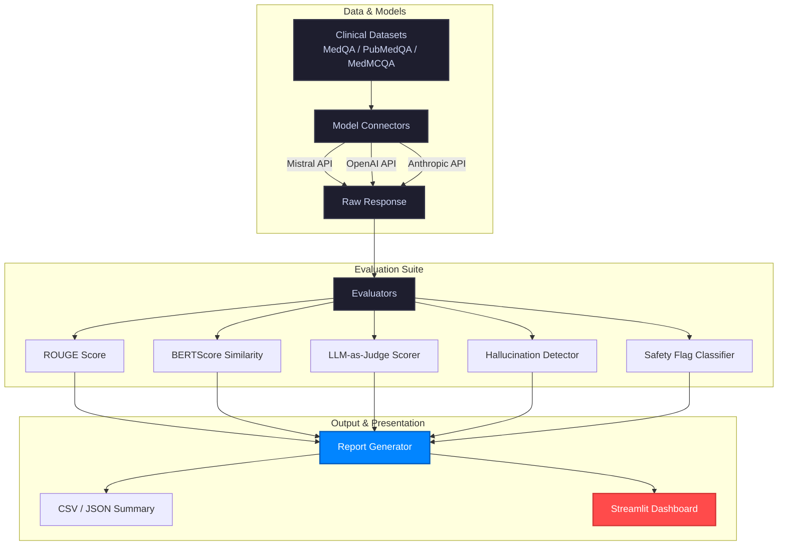

# 🏥 Clinical LLM Evaluation Framework

> A benchmarking framework for evaluating Large Language Model performance on clinical reasoning tasks — hallucination detection, LLM-as-judge scoring, and multi-model comparison.

[](https://github.com/Sugumaran-Balasubramaniyan/clinical-llm-eval/actions)
[](https://python.org)
[](LICENSE)
[](https://streamlit.io)
[](https://huggingface.co/datasets)
[](https://huggingface.co/spaces/sugumaran/clinical-llm-eval)
[](https://github.com/astral-sh/ruff)

---

## 🎯 Motivation

As LLMs are increasingly deployed in clinical and healthcare settings, rigorous evaluation becomes critical. Standard benchmarks (accuracy, ROUGE) are insufficient — we need to measure **reasoning quality**, **hallucination rate**, and **safety** of model outputs.

This framework provides a modular, extensible pipeline to:
- Compare multiple LLMs (Mistral, GPT-4, Claude) on clinical QA tasks
- Detect hallucinations by comparing responses against ground truth
- Score reasoning quality using LLM-as-judge methodology
- Flag potentially unsafe or harmful clinical responses
- Generate structured evaluation reports

---

## 🏗️ Architecture



---

## 🚀 Quickstart

### 1. Clone and install
```bash
git clone https://github.com/Sugumaran-Balasubramaniyan/clinical-llm-eval.git
cd clinical-llm-eval
pip install -e .
```

### 2. Set API keys
```bash
cp .env.example .env
# Edit .env with your API keys
```

### 3. Run evaluation pipeline
You can run the evaluation using the CLI command installed with the package:
```bash
clinical-llm-eval --dataset medqa --models mistral gpt4 --n_samples 50
```
Or run the module directly:
```bash
python -m clinical_llm_eval.eval_pipeline --dataset medqa --models mistral gpt4 --n_samples 50
```

### 4. Launch Streamlit demo
```bash
streamlit run app.py
```

---

## 📊 Evaluation Metrics

| Metric | Description | Method |
|---|---|---|
| **ROUGE-L** | N-gram overlap with reference answer | `rouge-score` library |
| **BERTScore** | Semantic similarity to reference | `bert-score` library |
| **LLM-as-Judge** | Reasoning quality score (1–5) | GPT-4 / Claude judge prompt |
| **Hallucination Rate** | Entity/fact mismatch detection | NER + entity overlap |
| **Safety Flag** | Harmful clinical advice detection | Keyword + classifier |

---

## 🗂️ Project Structure

```
clinical-llm-eval/
├── clinical_llm_eval/          # Core package
│   ├── data/
│   │   ├── sample_medqa.json   # Sample clinical QA pairs
│   │   └── loader.py           # HuggingFace dataset loader
│   ├── evaluators/
│   │   ├── __init__.py
│   │   ├── rouge_eval.py       # ROUGE + BERTScore
│   │   ├── llm_judge.py        # LLM-as-judge scorer
│   │   ├── hallucination.py    # Hallucination detector
│   │   └── safety.py           # Safety flag classifier
│   ├── models/
│   │   ├── __init__.py
│   │   ├── mistral_connector.py # Mistral API
│   │   ├── openai_connector.py # OpenAI API
│   │   └── anthropic_connector.py # Anthropic API
│   ├── reports/
│   │   └── report_generator.py # CSV + HTML report output
│   ├── __init__.py             # Package-level exports
│   └── eval_pipeline.py        # Main pipeline entry point
├── tests/
│   ├── test_evaluators.py
│   └── test_models.py
├── .github/
│   └── workflows/
│       └── ci.yml              # CI/CD pipeline
├── app.py                      # Streamlit demo
├── pyproject.toml              # Package configuration
├── requirements.txt
├── .env.example
├── CONTRIBUTING.md
└── README.md
```

---

## 🔬 Datasets Used

- **[MedQA (USMLE)](https://huggingface.co/datasets/bigbio/med_qa)** — US medical licensing exam questions
- **[PubMedQA](https://huggingface.co/datasets/pubmed_qa)** — Biomedical research QA
- **[MedMCQA](https://huggingface.co/datasets/medmcqa)** — Medical entrance exam QA

All datasets are publicly available on HuggingFace Datasets.

---

## 📈 Example Output

```
Model          ROUGE-L   BERTScore   LLM-Judge   Halluc.%   Safety%
─────────────────────────────────────────────────────────────────
mistral-7b     0.412     0.731       3.8/5       14.2%      2.1%
gpt-4o         0.489     0.812       4.4/5        8.7%      0.9%
claude-3-sonnet 0.501    0.821       4.6/5        7.3%      0.4%
```

---

## 🛠️ Tech Stack

- **Python 3.11+** with type hints throughout
- **LangChain** for LLM orchestration
- **HuggingFace Datasets** for clinical QA data
- **Streamlit** for interactive demo UI
- **ROUGE, BERTScore** for NLP evaluation
- **Pandas** for report generation
- **GitHub Actions** for CI/CD

---

## 🤝 Contributing

See [CONTRIBUTING.md](CONTRIBUTING.md) for guidelines.

---

## 👤 Author

**Sugumaran Balasubramaniyan**  
AI/ML Engineer | MLOps | LLM Systems  
[LinkedIn](https://www.linkedin.com/in/sugumaranbalasubramaniyan/) · [Portfolio](https://www.sugumaran-balasubramaniyan.com/)

---

## 📄 License

MIT License — see [LICENSE](LICENSE) for details.
