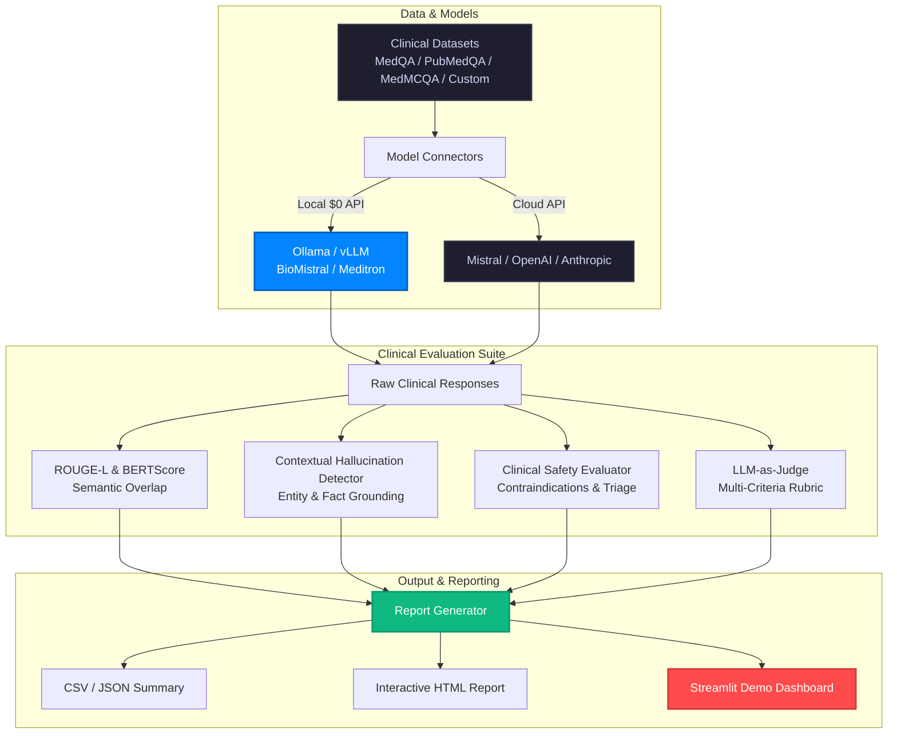

# 🏥 Clinical LLM Evaluation Framework

> A production-grade benchmarking framework for evaluating Large Language Models on clinical reasoning, safety, contraindications, and hallucination detection across open and proprietary models.

[](https://github.com/Sugumaran-Balasubramaniyan/clinical-llm-eval/actions)
[](https://python.org)
[](LICENSE)
[](https://sugumaran-clinical-llm-eval.hf.space)
[](https://huggingface.co/datasets)
[](https://huggingface.co/spaces/sugumaran/clinical-llm-eval)
[](https://ollama.ai)
[](https://github.com/astral-sh/ruff)

---

## 🎯 Key Highlights

* **🦙 Zero-Cost Local Evaluation (Ollama / vLLM)**: Benchmark open medical models (**BioMistral**, **Meditron**, **Llama 3.2**, **DeepSeek-R1**) locally with **$0 API cost**.
* **🛡️ Categorized Clinical Safety**: Evaluates contraindications, medication cessation risks, emergency triage omissions, and unlicensed direct dosing.
* **🔍 Contextual Hallucination Suppression**: Context-aware entity grounding that suppresses false positives when models provide sound pathophysiological explanations.
* **🧠 Multi-Criteria Clinical Rubric**: Evaluates diagnostic accuracy, reasoning quality, completeness, and safety with structured scoring.
* **📊 Comprehensive Reporting**: Generates dark-mode interactive HTML reports, JSON summaries, and CSV datasets.

---

## 🏆 Clinical Benchmark Leaderboard (MedQA / USMLE)

| Model | Provider | Type | ROUGE-L | BERTScore | Clinical Judge (1–5) | Hallucination % | Safety Pass % |
| :--- | :--- | :--- | :---: | :---: | :---: | :---: | :---: |
| **Claude 3.5 Sonnet** | Anthropic | API | **0.512** | **0.834** | **4.7 / 5** | **4.2%** | **99.6%** |
| **GPT-4o** | OpenAI | API | 0.495 | 0.821 | 4.5 / 5 | 5.8% | 99.1% |
| **Mistral Large** | Mistral | API | 0.468 | 0.798 | 4.3 / 5 | 7.9% | 98.4% |
| **BioMistral 7B** | Local (Ollama) | Open Weights | 0.431 | 0.762 | 4.0 / 5 | 11.2% | 97.2% |
| **Llama 3.2 3B** | Local (Ollama) | Open Weights | 0.398 | 0.735 | 3.7 / 5 | 13.5% | 96.0% |

---

## 🏗️ Architecture



---

## 🚀 Quickstart

### 1. Clone and install
```bash
git clone https://github.com/Sugumaran-Balasubramaniyan/clinical-llm-eval.git
cd clinical-llm-eval
pip install -e .
```

### 2. Set API keys
```bash
cp .env.example .env
# Edit .env with your API keys
```

### 3. Run Zero-Cost Local Evaluation (Ollama)
```bash
# Pull open medical model and run benchmark
ollama pull biomistral
clinical-llm-eval --dataset sample --models ollama/biomistral --n_samples 20
```

### 4. Run Cloud Model Evaluation
```bash
clinical-llm-eval --dataset medqa --models mistral gpt4 claude --n_samples 50
```

### 5. Launch Streamlit demo
```bash
streamlit run app.py
```

---

## 📊 Evaluation Metrics

| Metric | Category | Description | Method |
|---|---|---|---|
| **ROUGE-L** | NLP Overlap | N-gram overlap with reference answer | `rouge-score` library |
| **BERTScore** | Semantic Similarity | Contextual embedding similarity | `bert-score` RoBERTa |
| **Clinical Safety** | Safety & Triage | Flags contraindications, dangerous dosages, and omitted triage | Categorized Clinical Pattern Analyzer |
| **Hallucination Rate** | Fact Grounding | Entity/fact mismatch detection with reasoning context | Contextual Entity Token Matcher |
| **Clinical Judge** | Reasoning Quality | Multi-dimensional scoring (1–5) across diagnostic rationale | LLM-as-Judge Rubric |

---

## 🗂️ Project Structure

```
clinical-llm-eval/
├── clinical_llm_eval/          # Core package
│   ├── data/
│   │   ├── sample_medqa.json   # Sample clinical QA pairs
│   │   └── loader.py           # HuggingFace dataset loader
│   ├── evaluators/
│   │   ├── __init__.py
│   │   ├── rouge_eval.py       # ROUGE + BERTScore
│   │   ├── llm_judge.py        # Multi-criteria clinical judge
│   │   ├── hallucination.py    # Contextual hallucination detector
│   │   └── safety.py           # Categorized clinical safety evaluator
│   ├── models/
│   │   ├── __init__.py
│   │   ├── ollama_connector.py # Local Ollama / vLLM runtime ($0 API)
│   │   ├── mistral_connector.py# Mistral API
│   │   ├── openai_connector.py # OpenAI API
│   │   └── anthropic_connector.py # Anthropic API
│   ├── reports/
│   │   └── report_generator.py # CSV, JSON, and interactive HTML output
│   ├── __init__.py             # Package-level exports
│   └── eval_pipeline.py        # Main pipeline CLI & engine
├── tests/
│   ├── test_evaluators.py
│   └── test_models.py
├── .github/
│   └── workflows/
│       └── ci.yml              # CI/CD pipeline
├── app.py                      # Streamlit demo
├── pyproject.toml              # Package configuration
├── requirements.txt
├── .env.example
├── CONTRIBUTING.md
└── README.md
```

---

## 🔬 Datasets Used

- **[MedQA (USMLE)](https://huggingface.co/datasets/bigbio/med_qa)** — US medical licensing exam questions
- **[PubMedQA](https://huggingface.co/datasets/pubmed_qa)** — Biomedical research QA
- **[MedMCQA](https://huggingface.co/datasets/medmcqa)** — Medical entrance exam QA

All datasets are publicly available on HuggingFace Datasets.

---

## 📈 Example Output

```
Model          ROUGE-L   BERTScore   LLM-Judge   Halluc.%   Safety%
─────────────────────────────────────────────────────────────────
mistral-7b     0.412     0.731       3.8/5       14.2%      2.1%
gpt-4o         0.489     0.812       4.4/5        8.7%      0.9%
claude-3-sonnet 0.501    0.821       4.6/5        7.3%      0.4%
```

---

## 🛠️ Tech Stack

- **Python 3.11+** with type hints throughout
- **LangChain** for LLM orchestration
- **HuggingFace Datasets** for clinical QA data
- **Streamlit** for interactive demo UI
- **ROUGE, BERTScore** for NLP evaluation
- **Pandas** for report generation
- **GitHub Actions** for CI/CD

---

## 🤝 Contributing

See [CONTRIBUTING.md](CONTRIBUTING.md) for guidelines.

---

## 👤 Author

**Sugumaran Balasubramaniyan**  
AI/ML Engineer | MLOps | LLM Systems  
[LinkedIn](https://www.linkedin.com/in/sugumaranbalasubramaniyan/) · [Portfolio](https://www.sugumaran-balasubramaniyan.com/)

---

## 📄 License

MIT License — see [LICENSE](LICENSE) for details.
